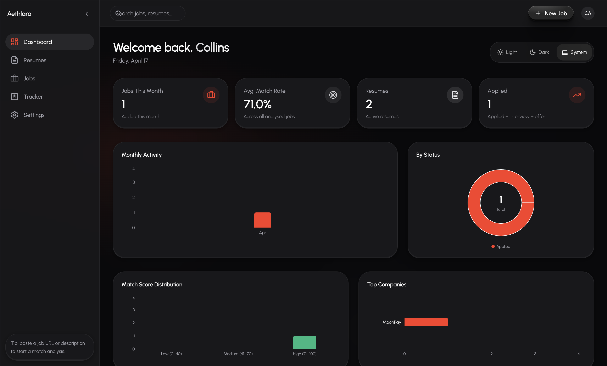
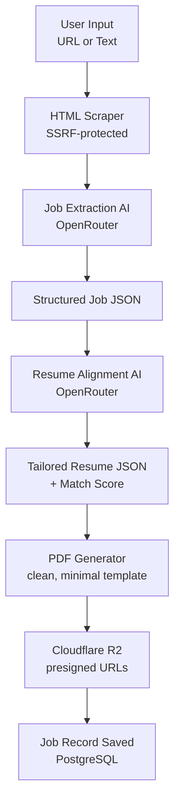

<div align="center">



# Aethlara

**An open-source, AI-powered job application platform that tailors your resume to every role you apply for.**

[](./LICENSE)
[](https://golang.org)
[](https://nodejs.org)
[](https://github.com/collinsadi/aethlara)
[](./CONTRIBUTING.md)

</div>

---

## Table of Contents

- [Overview](#overview)
- [Features](#features)
- [Tech Stack](#tech-stack)
- [Project Structure](#project-structure)
- [Getting Started](#getting-started)
  - [Prerequisites](#prerequisites)
  - [Clone the repository](#clone-the-repository)
  - [Backend setup (with Docker)](#backend-setup-with-docker--recommended)
  - [Backend setup (without Docker)](#backend-setup-without-docker)
  - [Frontend setup](#frontend-setup)
  - [Environment variables](#environment-variables)
- [Chrome Extension](#chrome-extension)
  - [What it does](#what-it-does)
  - [Download and install](#download-and-install)
  - [Build from source](#build-from-source)
- [API Documentation](#api-documentation)
- [How It Works](#how-it-works)
- [Open Source & Self-Hosting](#open-source--self-hosting)
- [Contributing](#contributing)
- [License](#license)
- [Author](#author)

---

## Overview

Aethlara is an open-source, AI-powered job application platform. You upload your resume once, paste a job URL or description, and Aethlara produces a tailored resume aligned to that specific role — plus a match score, a clean PDF, and a Kanban board to track every application through the pipeline.

**The problem.** Applying to jobs is a slog. Copy-pasting from job boards, rewriting the same resume a dozen different ways, guessing which roles are worth the effort. Most "AI resume" tools are closed, expensive, and quietly train on your data.

**The approach.** Aethlara is fully open source under MIT. The hosted version follows a bring-your-own-key model — you plug in your own OpenRouter API key, encrypted with AES-256-GCM, and pay only for the AI calls you make. No subscriptions, no lock-in, no hidden training. If you'd rather run the whole thing yourself, self-hosting is a `docker-compose up` away.

---

## Features

- **Passwordless OTP authentication** — email-based sign-in with bcrypt-hashed one-time codes and rotating refresh tokens
- **Resume upload + AI extraction** — drop in a PDF, DOCX, or Markdown file and get a structured resume JSON back
- **Job intake via URL scrape or text paste** — provide a link (with SSRF protection) or paste the description directly
- **AI job detail extraction** — parses raw postings into structured JSON (title, company, requirements, responsibilities)
- **AI resume tailoring + match scoring** — rewrites your resume against each job and returns a 1–100% alignment score
- **Tailored PDF resume generation** — each job gets its own clean, minimal PDF stored on Cloudflare R2
- **Kanban application status tracker** — drag jobs across stages with `dnd-kit`, with optimistic updates
- **Analytics dashboard** — match rate, monthly application trends, status breakdown, top companies
- **Encrypted API key management** — user API keys stored with AES-256-GCM; decrypted only inside the AI service
- **Cloudflare R2 file storage** — resumes and generated PDFs, served via short-lived presigned URLs
- **Light and dark mode** — every component themed via CSS variables
- **Chrome extension** — one-click job extraction and AI autofill on any application page (see [Chrome Extension](#chrome-extension))

---

## Tech Stack

| Frontend | Backend |
|---|---|
| React 19 + TypeScript | Go 1.22+ |
| Vite | Chi Router |
| Tailwind CSS v4 | PostgreSQL (via pgx) |
| React Query v5 | Cloudflare R2 (S3-compatible) |
| React Hook Form + Zod | OpenRouter (per-user API key) |
| dnd-kit | Resend (transactional email) |
| Recharts | AES-256-GCM encryption |
| React Router v7 | golang-jwt (access + refresh tokens) |
| Axios + js-cookie | Docker + Docker Compose |
| Framer Motion | Air (hot reload) |
| Zustand | `crypto/rand` for OTPs and refresh tokens |

---

## Project Structure

```
aethlara/
├── client/                   # React + TypeScript frontend (Vite)
│   ├── src/                  # Application source (api, components, hooks, pages, lib, stores)
│   ├── public/               # Static assets
│   ├── dist/                 # Production build output
│   ├── index.html
│   ├── vite.config.ts
│   ├── tsconfig.json
│   └── package.json
│
├── server/                   # Go REST API backend
│   ├── cmd/api/              # Application entrypoint
│   ├── internal/             # Domain modules (auth, user, resume, job, settings, analytics, ai, prompts, apikey, email, storage, middleware, database, config)
│   ├── pkg/                  # Shared utilities (response, validator, tokenutil)
│   ├── Dockerfile
│   ├── docker-compose.yml
│   ├── .air.toml             # Hot reload config
│   └── docs.md               # Full API documentation
│
├── extension/                # Chrome extension (Manifest v3, React + Vite)
│   ├── src/
│   │   ├── background/       # Service worker (auth handshake, message routing)
│   │   ├── content/          # Content scripts (page scanner, form filler, extractor)
│   │   ├── popup/            # React popup UI (pages, hooks, components)
│   │   ├── api/              # API clients (auth, jobs, resumes, autofill)
│   │   └── lib/              # Shared utilities (storage, queryClient, sanitise)
│   ├── manifest.json         # Manifest v3 declaration
│   ├── package.json
│   └── vite.config.ts
│
├── dashboard.png             # Dashboard preview
├── README.md
├── CONTRIBUTING.md
└── LICENSE
```

---

## Getting Started

### Prerequisites

- **Go** 1.22 or newer
- **Node.js** 18 or newer
- **PostgreSQL** 15 or newer (or Docker)
- A **Cloudflare R2** bucket with an access key pair
- A **Resend** account and API key for transactional email
- An **OpenRouter** account (self-hosters can set a default key; hosted users supply their own in-app)

### Clone the repository

```bash
git clone https://github.com/collinsadi/aethlara.git
cd aethlara
```

### Backend setup (with Docker — recommended)

```bash
cd server
cp .env.example .env
# Fill in your .env values (see "Environment variables" below)
docker compose up --build
```

The API will be available at `http://localhost:8080`.

### Backend setup (without Docker)

```bash
cd server
cp .env.example .env
# Fill in your .env values
go mod download
air   # or: go run cmd/api/main.go
```

### Frontend setup

```bash
cd client
cp .env.example .env   # if missing, create it with the line below
# VITE_API_URL=http://localhost:8080/api/v1
npm install
npm run dev
```

The client will be available at `http://localhost:5173`.

### Environment variables

The full variable reference lives in [`server/.env.example`](./server/.env.example) and `client/.env`. The most critical server variables:

| Variable | Purpose |
|---|---|
| `DATABASE_URL` | PostgreSQL connection string |
| `JWT_ACCESS_SECRET` / `JWT_REFRESH_SECRET` | JWT signing secrets (min 32 chars each) |
| `R2_ACCOUNT_ID` / `R2_ACCESS_KEY_ID` / `R2_SECRET_ACCESS_KEY` / `R2_BUCKET_NAME` / `R2_PUBLIC_ENDPOINT` | Cloudflare R2 credentials |
| `RESEND_API_KEY` | Resend API key for OTP and notification email |
| `API_KEY_ENCRYPTION_SECRET` | AES-256-GCM key for user-supplied OpenRouter keys |

> **Important.** `API_KEY_ENCRYPTION_SECRET` must be exactly **32 bytes** (64 hex chars). Generate one with:
>
> ```bash
> openssl rand -hex 32
> ```
>
> Changing this value after users have saved API keys will render those stored keys unrecoverable.

---

## Chrome Extension

The `extension/` folder contains the Aethlara Chrome extension — a Manifest v3 add-on that brings job extraction and AI-powered autofill into any tab you're browsing. It's the fastest way to capture roles from job boards (LinkedIn, Indeed, Wellfound, company careers pages) and to fill multi-page application forms (Workday, Greenhouse, Lever, Ashby) without copy-pasting.

### What it does

- **AI autofill** — Open any application form, click Autofill, and the extension fills every detected field using your tailored resume context. Powered by the same OpenRouter pipeline as the dashboard.
- **One-click job extraction** — Browsing a job posting? Pull out the structured details and see your match score before saving the role to your tracker.
- **Save-as-you-browse** — Capture interesting roles to your tracker without leaving the page, then come back later to tailor and apply.
- **Secure handshake auth** — Connects to your Aethlara account via a single-use, 60-second token issued by the dashboard. No passwords or refresh tokens ever live in the extension. Sessions last 15 minutes.
- **Scoped permissions** — `activeTab` only, host permissions limited to the Aethlara API domain (never `<all_urls>`).

### Download and install

The packaged extension lives at [`client/public/downloadable/aethlara-extension-v1.zip`](./client/public/downloadable/aethlara-extension-v1.zip) and is also available in-app:

1. Open the Aethlara dashboard or landing page and click **Download Extension** (or visit `/extension`).
2. Unzip the file — you should see a folder containing `manifest.json`, `background/`, `content/`, popup assets, and `icons/`.
3. Open your browser's extensions page (`chrome://extensions`, `brave://extensions`, `edge://extensions`, or `arc://extensions`).
4. Enable **Developer mode** (top-right toggle).
5. Click **Load unpacked** and select the unzipped folder (the one that directly contains `manifest.json`).
6. Pin the Aethlara icon to your toolbar via the puzzle-piece menu.
7. Open **Settings → Extension** in your Aethlara dashboard and click **Connect Chrome Extension** to complete the handshake.

A step-by-step guide with screenshots-style instructions is also available in-app at `/extension/install`.

### Build from source

If you'd rather build the extension yourself (recommended for self-hosted deployments so you can point it at your own API):

```bash
cd extension
cp .env.example .env
# Edit .env:
#   VITE_API_BASE_URL=https://your-api-domain.com/api/v1
#   VITE_DASHBOARD_URL=https://your-dashboard-domain.com
npm install
npm run build
```

The build output lives in `extension/dist/`. Load that folder as an unpacked extension via the steps above.

> **Note.** The bundled `aethlara-extension-v1.zip` is built against the hosted Aethlara API. Self-hosters should rebuild from source so the extension talks to their own server.

For the full extension reference (permissions, limitations, internal architecture), see [`extension/README.md`](./extension/README.md).

---

## API Documentation

Full endpoint documentation lives in [`server/docs.md`](./server/docs.md).

**Base URL:** `/api/v1`

Module groups:

- [Auth](./server/docs.md#authentication) — signup, verify-otp, login, refresh, logout, logout-all
- [User](./server/docs.md#7-get-userme) — profile (`/user/me`)
- Resumes — upload, list, preview URL, soft delete
- Jobs — create (URL or text), list, detail, status transitions, preview, delete
- Settings — API key CRUD, profile update, email change flow
- Analytics — dashboard aggregations

All responses follow a consistent envelope:

```json
{ "data": { "...": "..." }, "message": "optional string" }
```

```json
{ "error": { "code": "ERROR_CODE", "message": "Human-readable message." } }
```

---

## How It Works

The job creation pipeline turns a raw URL or pasted description into a tailored PDF in a single flow:



Every AI call is routed through a single service (`server/internal/ai/openrouter.go`) which decrypts the user's API key only at the moment of the call. Prompts are versioned in `server/internal/prompts/`.

---

## Open Source & Self-Hosting

Aethlara is fully open source under the [MIT License](./LICENSE).

- **Hosted version** — bring your own OpenRouter API key; no subscription, no usage caps beyond what OpenRouter charges you.
- **Self-hosted** — `docker compose up --build` in `server/`, `npm run dev` in `client/`, point the client at your server. That's it.
- **Contributions** — pull requests, issues, and discussions are all welcome. See [`CONTRIBUTING.md`](./CONTRIBUTING.md).

---

## Contributing

Aethlara is built in the open. Bug reports, feature ideas, and pull requests are genuinely welcome — please read [`CONTRIBUTING.md`](./CONTRIBUTING.md) for the commit convention, PR guidelines, and project structure guide before you start.

---

## License

Released under the [MIT License](./LICENSE).

Copyright © 2026 Collins Adi.

---

## Author

**Collins Adi** — [@collinsadi](https://github.com/collinsadi)
